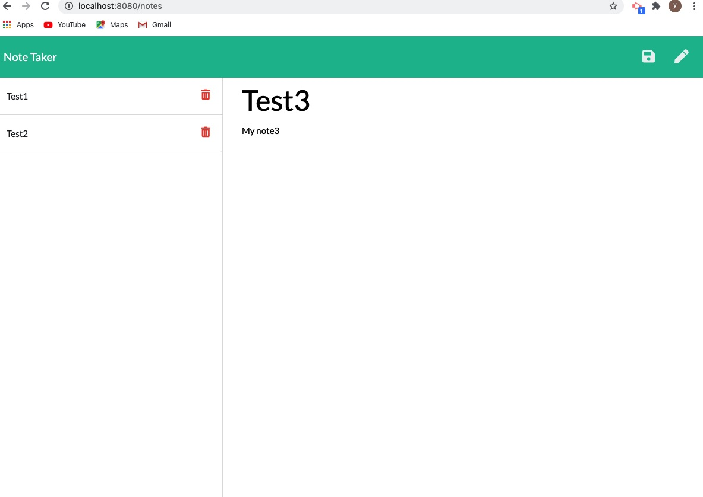

## Unit 11 Express Homework: Note Taker

### Description

The purpose of this application is to develop a note taker that can be used to write, save, and delete notes. This application uses node with express backend to save and retrieve note data from the JSON file. This application frontend has been created using bootstrap and css. 

### User Story

AS A user, I want to be able to write and save notes

I WANT to be able to delete notes I've written before

SO THAT I can organize my thoughts and keep track of tasks I need to complete

### Prerequisite

To execute the generate readme application, the user must first install node.js.

Steps to Install NodeJS: [Node.js Installation](https://docs.npmjs.com/downloading-and-installing-node-js-and-npm#windows-node-version-managers)

After installing node.js

To install NPM module dependencies, run the command:

```
npm install
```

The application will be invoked with the following command:

```
npm start
```

### Description

* The following HTML routes are created:

  * GET `/notes` - Returns the `notes.html` file.

  * GET `*`      - Returns the `index.html` file

* The following API routes are created:

  * GET `/api/notes`  - Reads the `db.json` file and return all saved notes as JSON.

  * POST `/api/notes` - Receives new note on the request body, add it to the `db.json` file and then displays the note.

  * DELETE `/api/notes/:id` - Receives a query parameter containing the id of a note. This unique `id` is used to delete a note from `db.json` file, after delete it displays all the notes from that file.


### Node.js Built-in Package

* fs -  Used fs.writeFileSync method to write to the file

* path - Used path.resolve, path.join method to deal with file paths


### NPM Module

* express - Express is a minimal and flexible Node.js web application framework that provides a robust set of features for web and mobile applications. Used express server for this project and also sets up the Express app to handle data parsing.

### Preview




### Submission Links

Link To the GitHub Repo : https://github.com/YakiniA/11-Express-NoteTaker

Link To the deployed application on Heroku : [Heroku Url](output/team.html)

Link To The Demo Video : [Demo Video](public/assets/Video.gif)

##### References

StackOverflow : [StackOverflow - Generating Random Numbers](https://stackoverflow.com/questions/18806210/generating-non-repeating-random-numbers-in-js)<br/>
StackOverflow : [StackOverflow - Remove item from array](https://stackoverflow.com/questions/5767325/how-can-i-remove-a-specific-item-from-an-array)<br/>
W3Schools : [W3Schools - Splice](https://www.w3schools.com/jsref/jsref_splice.asp)<br/>
Express : [Express Server](https://expressjs.com/)